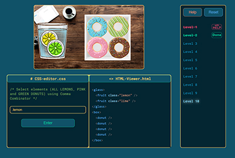

<!--
```swift
const AboutMe {
    name: "Elena",
    profession: "Frontend Developer",
    techStack: ["React.js", "JavaScript", "TypeScript", "HTML", "CSS", "SASS", "Material UI", "Jest", "Phaser"],
    background: ["Senior Researcher in Oncology", "PhD in Medicine"],
    languages: {
                english: "C1",
                russian: "native",
                polish: "B1-B2",
               },
    mission: ["integrate cutting-edge technology with medicine", "have fun"],
}
```-->
<h2 align="center">My stack</h2>
<p align="center">
    
    
    
    
    
    
    
    
    
    
</p>
<h2 align="center">My projects</h2>
<div style="display: flex; flex-direction: row; justify-content: space-between;">
    <div>
      
      <div style="display: flex; flex-direction: row; justify-content: space-between;">
        <p>project1</p>
        <p>line1</p>
        <p>line2</p>
      </div>
    <div>
      
      <div style="display: flex; flex-direction: row; justify-content: space-between;">
        <p>project2</p>
        <p>line1</p>
        <p>line2</p>
      </div>
    </div>
</div>

<!--
**elen-jagger/elen-jagger** is a ✨ _special_ ✨ repository because its `README.md` (this file) appears on your GitHub profile.

Here are some ideas to get you started:

- 🔭 I’m currently working on ...
- 🌱 I’m currently learning ...
- 👯 I’m looking to collaborate on ...
- 🤔 I’m looking for help with ...
- 💬 Ask me about ...
- 📫 How to reach me: ...
- 😄 Pronouns: ...
- ⚡ Fun fact: ...
-->
